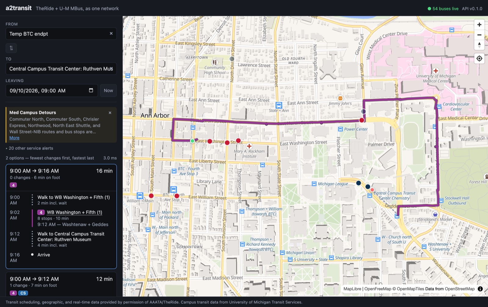
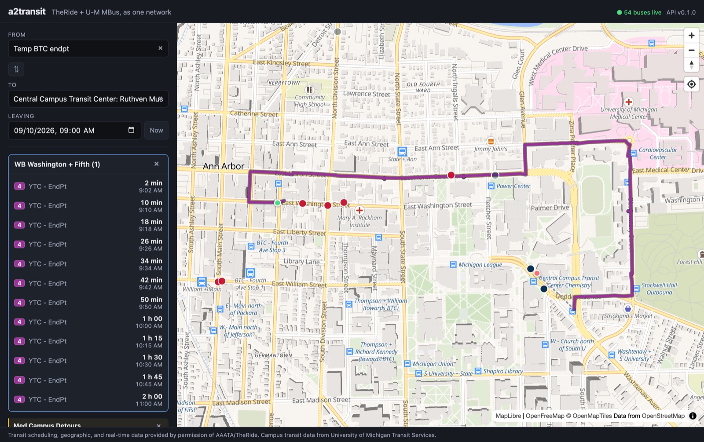
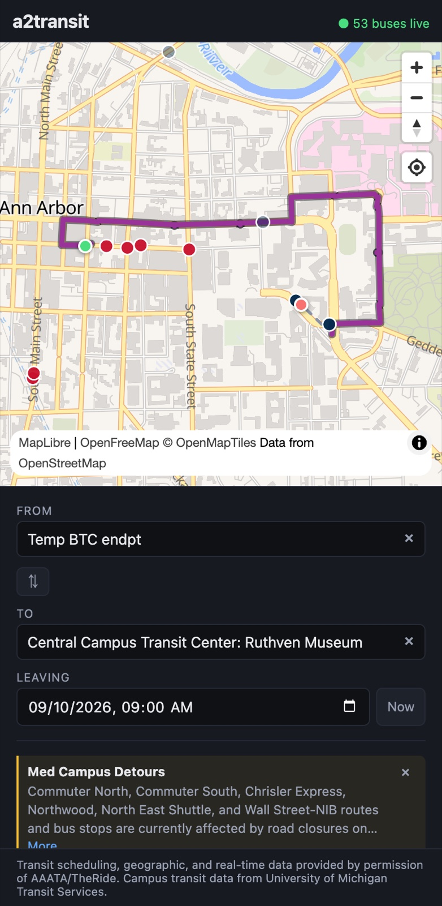

<h1 align="center">a2transit</h1>

<p align="center">
  <strong>Door-to-door journey planning across Ann Arbor's two bus networks — as one network.</strong><br>
  TheRide (AAATA), the city system, and U&#8209;M MBus, the university shuttles,
  merged into a single routing graph with the transfers between them included.
</p>

<p align="center">
  
  
  
  
  
  
  
</p>

<p align="center">
  
</p>

## The problem

**Neither agency's trip planner will route you across the other's network** —
not even where their stops share a corner. 728 of their stop pairs sit within
400 m of each other and [several are under 2 m apart][premise]: TheRide's
"Bonisteel + Beal" and MBus's "Cooley Lab Outbound" are the same piece of
pavement, 40 cm apart, and no planner in existence will connect them.

So a rider going from downtown to the medical campus is told to take one bus and
walk, or is told nothing at all.

a2transit answers it in **3 milliseconds**: Blake Transit Center to Central
Campus is twelve minutes — TheRide route 4, a three-minute walk at Washtenaw and
Geddes, then MBus CS. It plans from a street address to a street address,
adjusts for buses that are actually running late, and shows you where they are.

[premise]: docs/feeds.md#2-the-cross-agency-transfer-premise-is-real

## Why it is harder than it sounds

| | |
|---|---|
| **The IDs collide, and silently** | 90 `stop_id`s, 800 `trip_id`s and all three of TheRide's `service_id`s appear in both feeds as different things. TheRide's service `3` means Mon–Fri; MBus's means Monday only. Joining them yields a *plausible* schedule that is wrong. Every key in the schema is composite. |
| **Time is not a clock** | GTFS times pass midnight — MBus reaches `27:15:00`. Stored as integer seconds from service midnight over a {D−1, D, D+1} window, so a query at 00:30 still sees yesterday's buses. |
| **The calendar is load-bearing** | Reading `calendar.txt` alone gives 3,620 MBus trips on an ordinary Thursday instead of 1,668, and 3,490 on Labor Day instead of 366. |
| **Fast and correct are different programs** | RAPTOR is the engine; a time-expanded Dijkstra is kept as an oracle and 500 seeded cases are run through both. It has caught three real bugs that tests written against the fast path would have agreed with. |
| **The feeds move** | Both agencies' published GTFS URLs were dead when this started. TheRide's realtime endpoints are in no registry at all and were traced through their Clever Devices backend. |

## What it does

<table>
<tr>
<td width="50%" valign="top">

**Plans across both agencies.** Every non-dominated option — fewest changes
first, fastest last — with the route drawn along its published shape and walking
legs dashed.

**Door to door.** Type a street address, or click the map. A place becomes a
stop no vehicle serves, joined to the network by footpaths, so both routing
engines handle it without knowing what a place is.

**Live.** GTFS-Realtime folded into the timetable *before* the search runs, so
delays change which bus you are told to catch — not just the number printed next
to it.

</td>
<td width="50%" valign="top">



</td>
</tr>
</table>



**Departure boards** off any boarding stop, read from the router's own timetable
so the board and the planner agree about holidays.

**Service alerts, ranked** — the two agencies publish 23 at a time, most about
somewhere you are not going. Alerts naming a route in your plan show; the rest
collapse behind a count.

**Shareable links.** The trip lives in the query string.

**Keyboard and screen readers.** The search is a real combobox: arrows, Enter,
Escape, `aria-activedescendant`.

**Mobile.** Map above, itinerary below.

<br clear="right">

## Numbers

| | |
|---:|---|
| **3.1 ms** | median plan, p95 7.5 ms — against a 50 ms target |
| **19×** | faster than the Dijkstra reference it is checked against |
| **0** | arrival mismatches across 500 seeded differential cases |
| **8,308** | generated footpaths, 1,456 of them crossing between agencies |
| **345,160** | rows loaded from both feeds, in ~2.5 s |
| **370** | tests — 344 backend, 26 frontend |
| **$0** | every tier runs on a free plan, no credit card |

All of it reproducible: [`scripts/measure.py`](scripts/measure.py) prints every
figure above in one run. Details under [Measurements](#measurements).

---

## The stack

| | |
|---|---|
| Routing | RAPTOR (round-based), validated against a time-dependent Dijkstra reference |
| Walking | PostGIS `ST_DWithin` footpaths — 8,308 links, 1,456 of them across agencies |
| Backend | Python 3.12 · FastAPI · SQLAlchemy |
| Data | PostgreSQL + PostGIS |
| Realtime | GTFS-Realtime pollers → Redis pub/sub → WebSocket |
| Frontend | React · Vite · MapLibre GL JS |
| Tiles | OpenFreeMap (no key, no account) |

Every dependency is free with no credit card on file. Deployment targets are
free tiers: Fly.io or Render (API), Neon or Supabase (Postgres), Upstash
(Redis), Vercel or Cloudflare Pages (frontend).

**Where to read next.** [Getting started](#getting-started) to run it ·
[Two engines](#two-engines) for why there are two ·
[Walking](#walking-and-why-it-took-a-milestone) for the milestone that made the
two networks one · [Realtime](#realtime) for how live data reaches the search ·
[Measurements](#measurements) for the numbers and the script that produces them ·
[Milestones](#milestones) for how it was built, in order.

---

## Getting started

**Prerequisites:** Python 3.12+, Node 20+, Docker.

```bash
cp .env.example .env
docker compose up -d
```

Wait for both services to report healthy:

```bash
docker compose ps
```

**Backend** — from `backend/`:

```bash
python3.12 -m venv .venv && ./.venv/bin/pip install -e '.[dev]'
./.venv/bin/uvicorn a2transit.main:app --reload --port 8001
```

**Frontend** — from `frontend/`:

```bash
npm install && npm run dev
```

Then: API docs at <http://localhost:8001/docs>, app at <http://localhost:5174>.

Type a stop name or a street address into either field, or click the map. The
planner returns every non-dominated option — fewest changes first, fastest
last — and draws the selected one along the route's published shape.

> **Ports.** The API defaults to **8001** and Vite to **5174**, not the usual
> 8000/5173, because those are already in use by another project on the
> development machine. Change them in `docker-compose.yml`, `vite.config.ts`,
> and `.env` if you want the conventional ones.

## Deploying

Everything needed is committed: `backend/Dockerfile`, `fly.toml`, `render.yaml`
and `frontend/vercel.json`. What is *not* committed is any account — creating
those and pasting in the credentials is the one part that has to be done by
hand.

| Tier | Service | Free plan |
|---|---|---|
| API + poller | Fly.io or Render | yes, scales to zero |
| Postgres + PostGIS | Neon or Supabase | yes |
| Redis | Upstash | yes |
| Frontend | Vercel or Cloudflare Pages | yes |

```bash
# 1. Provision Postgres (with PostGIS) and Redis, then load the feeds into it:
DATABASE_URL=postgresql+psycopg://... backend/.venv/bin/python -m a2transit.ingest

# 2. API and poller
fly launch --no-deploy
fly secrets set DATABASE_URL=... REDIS_URL=... CORS_ORIGINS=https://your-frontend
fly deploy

# 3. Frontend
VITE_API_BASE_URL=https://your-api npm --prefix frontend run build
```

The image was built and run against a live database before being committed: it
plans the cross-agency Blake→Central Campus trip from inside the container.

Three things about the deployment that are load-bearing rather than incidental:

- **`/ready` treats Redis as optional.** Postgres missing is a 503 — there is
  nothing to plan on. Redis missing is a 200 with `"status": "degraded"`,
  because realtime is an enhancement by construction and failing readiness would
  pull a working planner out of the load balancer over the loss of a feature it
  is designed to survive.
- **One uvicorn worker per instance.** The timetable cache is per-process and a
  service date is ~120 MB resident, so four workers is four copies of the same
  tables. Scale with instances.
- **The SPA needs a catch-all rewrite.** A shared trip link carries its state in
  the query string, and without the rewrite it 404s on reload — which is the one
  URL people actually paste.

### Realtime

```bash
cd backend
./.venv/bin/python -m a2transit.realtime              # poll both agencies
./.venv/bin/python -m a2transit.realtime --once       # one cycle
./.venv/bin/python -m a2transit.realtime --simulate-delay theride:3572020:900
```

Six feeds — vehicles, trips and alerts for each agency — every 20 seconds into
Redis. The poller is one process regardless of how many API workers run: the
agencies see one client, and an API restart does not interrupt the feed.

**Realtime is an overlay, not a mode.** Predictions are folded into a copy of
the cached schedule timetable, and RAPTOR is handed something it cannot tell
from the schedule — so the Pareto set, the horizon, the transfer floor and every
differential test keep working unchanged. The consequence worth having: a
delayed bus is not merely reported as late, it *loses*. Delay route 4's 06:02 by
fifteen minutes and the planner puts the rider on the 06:10 instead.

Everything written to Redis expires. Stale realtime is worse than none — a
five-minute-old "on time" will send someone running for a bus that has gone — so
if the poller dies the keys drain and planning falls back to the schedule
inside two minutes, with no health check to wire up and no code path that only
runs during an outage.

Neither agency publishes `delay`; both publish absolute predicted times. A delay
therefore does not exist until something compares a prediction to the schedule,
which is why `realtime/delays.py` is the only module that holds both.

### The API

| Endpoint | What it does |
|---|---|
| `GET /plan?from=&to=&depart=` | Every non-dominated itinerary. Each end is `agency:stop_id` or `lat,lon`, and the two mix freely. Ride legs carry the route's real geometry, clipped out of the GTFS shape. |
| `GET /stops/search?q=` | Trigram autocomplete over both feeds' stops. |
| `GET /stops/{agency}/{id}/departures` | The next departures, read off the router's own timetable so the board and the planner agree about holidays. |
| `GET /geocode?q=` | Address to coordinates. Proxied server-side because Nominatim's policy asks for a real User-Agent and one request a second, which a browser tab cannot promise. |
| `GET /realtime/status` | Whether live data is flowing, and how old each feed is. |
| `GET /realtime/vehicles` · `/realtime/alerts` | Snapshots, for callers that would rather not hold a socket open. |
| `WS /ws/vehicles` | Live positions. Opens with the current snapshot, then forwards each poll. Every frame is a whole snapshot, never a diff, so a dropped frame costs nothing and reconnection needs no reconciliation. |

```bash
curl 'localhost:8001/plan?from=theride:1605&to=mbus:207&depart=2026-09-10T09:00'
```

### Health checks

| Endpoint | Meaning |
|---|---|
| `GET /health` | Process liveness. Always 200 if the app responds; touches no dependency. |
| `GET /ready` | Readiness. 200 when Postgres (with PostGIS) and Redis both answer, 503 otherwise, naming what failed. |

`/ready` returning 503 with `"database": "unavailable"` before you have run
`docker compose up` is correct behaviour, not a bug.

---

## Testing

```bash
cd backend
./.venv/bin/pytest              # 344 tests
./.venv/bin/pytest -m slow      # the 500-case differential
./.venv/bin/pytest -m network   # against the live agency feeds
./.venv/bin/ruff check ..

cd ../frontend
npm test                        # 26 tests, no browser needed
```

The frontend tests cover the browser-shaped logic that has no oracle: trip
links round-tripping through the address bar, and the local-time formatting
that `toISOString()` would silently shift by four hours. The routing itself is
checked against two independent engines in Python, which is a much stronger
thing to have than a React component snapshot.

Two markers keep the default run fast and self-contained:

| Marker | Behaviour |
|---|---|
| `network` | Deselected by default. Hits the live feeds and the geocoder — run before trusting anything about the data. |
| `slow` | Deselected by default. The full 500-case differential between the two engines. |
| `db` | Runs by default, but **skips itself** when Postgres is unreachable, so the suite still passes on a plane. |

`db` tests use their own `a2transit_test` database, created on demand. They
never touch your development data — the loader's delete-and-reload would
otherwise wipe it on every run.

To re-verify every agency endpoint at once — worth doing whenever something
looks wrong with the data:

```bash
./backend/.venv/bin/python scripts/verify_feeds.py
```

---

## Loading the feeds

```bash
cd backend
./.venv/bin/python -m a2transit.ingest
```

Creates the schema on first run, loads both agencies, then rebuilds everything
derived from them — RAPTOR patterns and the PostGIS footpath table. Unchanged
feeds are skipped, so this is safe to run on a schedule —
TheRide's licence requires refreshing within three business days of a new
publication:

```bash
0 4 * * 1  cd /path/to/a2transit/backend && .venv/bin/python -m a2transit.ingest
```

`--agency theride|mbus` for one feed, `--force` to reload regardless,
`--from-file PATH` for a local ZIP.

Current scale (2026-08-23 feeds):

| | TheRide | MBus | total |
|---|---:|---:|---:|
| stops | 1,055 | 120 | 1,175 |
| routes | 30 | 16 | 46 |
| trips | 4,235 | 8,432 | 12,667 |
| stop_times | 106,066 | 108,658 | 214,724 |
| shape points | 73,507 | 19,102 | 92,609 |
| **all tables** | **185,005** | **136,695** | **321,700** |

Full load takes ~2.5 s. Preprocessing then derives 117 route patterns and
**8,308 footpaths** (1,456 of them between the two agencies) in under a second.

## Planning a trip

```bash
cd backend
./.venv/bin/python -m a2transit.routing --search "YTC"
./.venv/bin/python -m a2transit.routing \
    --from theride:1605 --to mbus:207 --depart 2026-09-10T09:00 -v
./.venv/bin/python -m a2transit.routing \
    --from-place "Kerrytown, Ann Arbor" --to-place "Michigan Stadium" \
    --depart 2026-09-10T09:00
```

```
Temp BTC endpt -> Central Campus Transit Center: Ruthven Museum
  depart Thu 2026-09-10 09:00  arrive 09:12  (12 min, 1 transfer)
    09:00 transfer to WB Washington + Fifth (1) (2 min incl. wait)
    09:02 WB Washington + Fifth (1)  --[theride 4]-->
    09:06 S - Huron  east of Ingalls
    09:06 transfer to Rackham Bldg (3 min incl. wait)
    09:08 Rackham Bldg  --[mbus CS]-->
    09:10 Central Campus Transit Center: Chemistry
    09:10 transfer to Central Campus Transit Center: Ruthven Museum (2 min incl. wait)
```

That journey uses both agencies and could not be answered before M4. A bare
`stop_id` is rejected when both feeds use it — 90 do, as different places — so
stops are written `agency:stop_id`. An endpoint may equally be an address
(`--from-place`, geocoded) or a coordinate pair (`--from-latlon`).

### Two engines

**RAPTOR** (M3) is the one you use. **Dijkstra over a time-expanded graph** (M2)
is kept as the correctness reference: every node carries a time and every edge
points forward, making the graph a DAG whose topological order is time order, so
earliest-arrival needs no argument about FIFO or non-overtaking. That is exactly
what makes it a trustworthy oracle rather than a second opinion.

| | RAPTOR | Dijkstra |
|---|---:|---:|
| p50 | **3.1 ms** | 60 ms |
| p95 | **7.5 ms** | 239 ms |
| Timetable build | 315 ms | 518 ms |
| Criteria | earliest arrival **and** fewest transfers | earliest arrival |

RAPTOR is roughly **19x faster** at p50 and 32x at p95, against an acceptance
target of 50 ms. Both engines got slower when M4 added 8,308 footpaths, which is
the cost of the two networks being one; RAPTOR went from 1.4 ms to 3.1 ms. Full
figures, and the command that produces them, under [Measurements](#measurements).

The network is small — 42 GTFS routes become 117 patterns over 2,498
pattern-stops — so a round is ~2,500 stop visits, where the Dijkstra searches a
113,000-node, 394,000-edge graph.

Footpaths could have made that graph five times larger. Every walk landing at
its own exact time would add ~467,000 nodes; instead a walk edge points at the
first platform node at or after it lands, because landing is only ever a
prelude to boarding and every departure is already a platform time. Node count
is unchanged, and walks originate only at vehicle arrivals and the origin —
which is what makes a second walk in a row structurally impossible rather than
merely discouraged.

Pick an engine with `--algorithm raptor|dijkstra`, or run both with `--compare`.

### Walking, and why it took a milestone

Footpaths are what make "TheRide + MBus as one network" true rather than
aspirational. Before them the two agencies touched nowhere: they publish 15
usable transfers between them, all TheRide's, all inside Ypsilanti Transit
Center, so a TheRide-to-MBus query correctly returned nothing.

One `ST_DWithin` self-join over the GiST index on `stops.geog` produces 8,308
directed links at 400 m, 1,456 of them crossing between the feeds. Three things
had to change together, because changing any one alone makes the two engines
disagree:

1. **Both engines read the same table.** That retired a transitive closure both
   of them ran to work around TheRide declaring `103→108` and `108→101` and no
   `103→101`. The retired algorithm now lives in the test that justified its
   deletion, applied to the live feed: every edge it invents exists directly in
   the 400 m set.
2. **Walking into a stop is arriving there.** Both engines targeted vehicle
   arrivals only, so a rider dropped 100 m from their destination was told the
   trip was impossible.
3. **A place is a stop no vehicle serves.** An arbitrary lat/lon becomes a
   synthetic stop joined to the network by footpaths, so neither engine needs
   any notion of a place — and door-to-door queries are differentially tested
   by exactly the machinery that tests stop-to-stop ones.

The differential earned its keep here. It caught RAPTOR pruning a vehicle
arrival against an earlier arrival *on foot* at the same stop, which is
tempting and wrong: only a vehicle arrival licenses walking onward, so the
better-looking label was the unusable one. Four of 500 cases, all on one
Saturday, all found by comparing against an engine that cannot make that
mistake because it does not have the concept.

### How the second criterion is verified

Fewest-transfers has no oracle in M2, which answers earliest arrival only, so it
rests on three independent legs rather than on differential testing alone:

1. **A bounded-transfers oracle** (`routing/bounded.py`) extends the M2 search
   with a vehicle budget — labels become `(node, boardings)` over the same DAG.
   Slow, and reaching the answer by constrained shortest path rather than by
   rounds, so agreement is evidence. It checks *every* entry of the Pareto set,
   not just the fastest.
2. **Hand-verified pairs where the criteria disagree**, read out of `stop_times`
   first. MBus 218 to 247 at 08:45 offers 1 transfer arriving 09:43:55 or 2
   transfers arriving 09:38:59.
3. **Invariants on every query** — arrivals strictly decrease as transfers
   increase, leg count matches the declared transfer count, no entry is
   dominated, legs chain, every transfer clears the floor.

Differential testing against M2 is seeded (`compare.SEED = 20260910`), so case N
is the same case on every run and a failure prints the command that replays it.
500 cases across a weekday, Labor Day and a Saturday: **0 arrival mismatches**.
54 cases pick different trips with identical arrival times, which is a tie broken
differently and not a disagreement.

Known limitations, all deliberate:

- **Walking is a straight line with a detour allowance.** Distances come from
  PostGIS `ST_Distance` over `geography` and are multiplied by 1.3 before
  becoming seconds. A real network router (OSRM) would do better, and is
  deliberately kept off the critical path: it is a rate-limited demo server
  with no SLA, and a journey planner must not stop working because someone
  else's free service is busy.
- **One footpath per leg, never two in a row.** A rider may walk at most 400 m
  between vehicles, and 800 m to reach the network or leave it. Chaining walks
  would let the planner route someone across town on foot in a round.
- **Tight timed transfers at pulse points are rejected.** Every TheRide transfer
  declares `min_transfer_time = 10 s` across bays up to 71 m apart — 25 km/h on
  foot — so a 60 s floor is applied instead. TheRide does hold connecting buses
  at Blake Transit Center, but GTFS has no way for them to say so in the data
  they publish, so nothing distinguishes a held connection from a coincidental
  one.
- **Boardings are bounded by a six-hour horizon.** A ride boarded inside it may
  finish outside it; cutting a trip off mid-ride would report "unreachable" for
  a bus the rider is already on.

### Service dates are not calendar days

Two things the engine has to get right, both of which fail quietly rather than
loudly:

**GTFS times pass 24:00:00.** MBus reaches `27:15:00`. Times are stored as
integer seconds from service midnight and normalised against a {D−1, D, D+1}
window, so a query at 00:30 still sees the buses that belong to yesterday's
service date.

**`calendar_dates` is load-bearing, not an edge case.** MBus overlays several
`service_id`s onto each weekday and removes most again by exception. Reading
`calendar.txt` alone gives 3,620 trips on an ordinary Thursday instead of 1,668,
and 3,490 on Labor Day instead of 366.

## Data sources

Full detail, provenance, and licence terms: **[docs/feeds.md](docs/feeds.md)**.

| Agency | Static GTFS | GTFS-Realtime |
|---|---|---|
| TheRide (AAATA) | `theride.org/sites/default/files/google/google_transit.zip` | `rt.theride.org/gtfsrt/{vehicles,trips,alerts}` |
| U-M MBus | `webapps.fo.umich.edu/transit_uploads/google_transit.zip` | `mbus.ltp.umich.edu/gtfsrt/{vehicles,trips,alerts}` |

Two caveats worth knowing before you trust these:

1. **The URLs most often cited online are dead.** Both agencies moved their
   static feed; the widely-linked `theride.org/google/google_transit.zip` now
   404s. `scripts/verify_feeds.py` exists so this fails loudly, early.
2. **TheRide's realtime endpoints are undocumented.** They serve unauthenticated,
   spec-compliant GTFS-Realtime v2.0 protobuf, but they appear in no feed
   registry and on no developer page — [see how they were traced](docs/feeds.md#provenance-of-the-realtime-urls--read-this-before-depending-on-them).
   Treat realtime as best-effort: routing must fall back to schedule-only when
   it is unavailable.

### Attribution

TheRide's data licence requires this notice be displayed prominently wherever
their data appears, and that the GTFS data be refreshed within three business
days of a new publication:

> Transit scheduling, geographic, and real-time data provided by permission of AAATA/TheRide.

---

## Architecture

```
GTFS static (TheRide + MBus)  ──▶  ingest job  ──▶  Postgres + PostGIS
                                                        │
                                          preprocessing: RAPTOR route-patterns,
                                          stop→routes index, footpaths (PostGIS
                                          ST_DWithin, 400 m, cross-agency)
                                                        │
GTFS-Realtime (both agencies)  ──▶  poller  ──▶  Redis  ──▶  timetable overlay
                                             │                   │
                                             │            FastAPI /plan endpoint
                                             │                   │
                                     WebSocket push  ──────▶  React + MapLibre frontend
```

### The one design constraint you cannot ignore

**Stop, trip, and service IDs collide across the two agencies, and the
collisions are meaningless.** 90 `stop_id` values, 800 `trip_id` values, and all
three of TheRide's `service_id` values appear in both feeds. Of the 90 colliding
stop IDs, exactly one pair is co-located — TheRide's stop `161` is "Tyler +
Zephyr", MBus's is "TEST STOP 1", 14.9 km away.

The `service_id` collision is the dangerous one, because it fails quietly:
TheRide's `3` means Mon–Fri, MBus's `3` means Monday only.

So every key is composite — `(agency_source, stop_id)`, `(agency_source,
trip_id)` — including when resolving a `trip_id` off a realtime feed. Getting
this wrong does not throw; it silently routes a rider onto the wrong agency's
bus.

---

## Milestones

- [x] **M0 — Verify feeds + scaffold.** Confirm live GTFS static and GTFS-RT
      endpoints for both agencies; document formats and licence terms. FastAPI
      app, docker-compose (PostGIS + Redis), Vite/React skeleton.
      *Done: `docker compose up` gives a working DB; `GET /health` returns 200.*
- [x] **M1 — GTFS ingest.** Load both agencies into Postgres with a sane schema
      and indexes; idempotent weekly `refresh`.
      *Done: 321,700 rows across both feeds in ~2.5 s; reload is byte-identical;
      Route 4 verified against the published schedule.*
- [x] **M2 — Routing v1 (correctness).** Earliest-arrival Dijkstra over a
      time-expanded graph.
      *Done: 6 hand-verified pairs incl. a cross-midnight arrival and a holiday
      service change; p50 146 ms / p95 198 ms over 200 random queries.*
- [x] **M3 — Routing v2 (RAPTOR).** Round-based, earliest-arrival and
      fewest-transfers.
      *Done: 0 mismatches over 500 seeded differential cases; p50 1.4 ms on
      routable queries against Dijkstra's 114 ms.*
- [x] **M4 — Walking / footpaths.** PostGIS `ST_DWithin` stop→stop links
      (400 m, cross-agency included); arbitrary lat/lon joined to nearby stops.
      *Done: 8,308 footpaths, 1,456 across agencies; door-to-door between two
      street addresses; 0 mismatches over 500 differential cases after the
      differential caught two engine bugs.*
- [x] **M5 — HTTP API.** `/plan`, `/stops/search`, `/stops/{id}/departures`,
      `/geocode`. *Done: OpenAPI at `/docs`; the Pareto set with each ride leg's
      real shape; timetables cached per service date.*
- [x] **M6 — Frontend.** Geocoding, stop autocomplete, route drawn on the map,
      itinerary panel. *Done: one field takes a stop or an address; mobile
      layout; walk legs dashed, rides drawn along the published shape.*
- [x] **M7 — Realtime.** Poll GTFS-RT into Redis; delay-adjusted arrival times;
      WebSocket vehicle markers and alerts. *Done: ~250 predictions folded into
      the timetable in 50 ms; a 15-minute delay on route 4's 06:02 does not just
      move the arrival, it moves the rider to the 06:10.*
- [x] **M8 — Polish + deploy.** Shareable trip URLs, live departures board,
      filtered service alerts, keyboard-navigable search, error and empty
      states, and a container plus manifests for all four tiers on free plans.
      *Deploy-ready; the public URL needs accounts I do not have — see below.*
- [x] **M9 — Measure.** Feed scale, query latency p50/p95, correctness
      spot-checks, realtime end-to-end lag. *Done: `scripts/measure.py` produces
      every figure below in one run, so they can be re-checked rather than
      remembered.*

## Measurements

Everything below comes from one command, so the numbers can be re-checked after
a feed refresh rather than trusted because they are written down:

```bash
./backend/.venv/bin/python scripts/measure.py --cases 200 --realtime
```

Measured 2026-09-03 against the 2026-08-23 feeds, on an M-series laptop.

**Scale.** 345,160 rows: 214,724 stop_times, 92,609 shape points, 12,667 trips,
117 route patterns over 2,498 pattern-stops, and 8,308 footpaths of which 1,456
cross between the agencies.

**Build cost.** RAPTOR timetable 315 ms; Dijkstra timetable 518 ms; the
time-expanded graph 185 ms for 113,213 nodes and 393,618 edges.

**Query latency**, 200 seeded cases across a weekday, Labor Day and a Saturday:

| | p50 | p95 |
|---|---:|---:|
| RAPTOR | **3.1 ms** | **7.5 ms** |
| Dijkstra reference | 59.6 ms | 238.6 ms |

19× at p50, 32× at p95, against an acceptance target of 50 ms. Door-to-door
between two addresses is 5.6 ms p50 for the query plus 3.3 ms to attach the two
places, which is one PostGIS round trip.

**Correctness.** 0 arrival mismatches over 500 differential cases. 49 of 200
cases pick different trips at an identical arrival time, which is a tie broken
differently and not a disagreement. The four spot-checks the script runs — a
direct trip, a cross-agency trip, a three-option trade-off, and a post-midnight
arrival — all land on their hand-verified answers.

**Realtime.** Feeds are 14–32 s old when fetched, which is the agencies'
publication lag and not something a consumer can improve. Applying 239 live
predictions to the timetable takes 12 ms and moves 226 runs across 48 patterns;
worst delay observed in that sample was 23 minutes. Stored snapshots were
33–45 s old against a 120 s expiry, so the schedule fallback had ~75 s of
headroom.

The honest summary of where the time goes: a query is ~3 ms, and everything
around it — building a timetable, attaching a place, folding in realtime — is
between 3 ms and 500 ms. Which is why the timetables are cached per service date
and the realtime overlay is cached per poll.

## Repository layout

```
backend/
  a2transit/
    api/         FastAPI routers
    db/          SQLAlchemy engine, session, models
    ingest/      GTFS static parsing and loading      (M1)
    routing/     Dijkstra reference + RAPTOR          (M2, M3)
    realtime/    GTFS-RT pollers, Redis, WebSocket    (M7)
  tests/
frontend/        Vite + React + MapLibre
docker/initdb/   Extensions installed on first DB boot
docs/feeds.md    Feed endpoints, provenance, licences
scripts/         verify_feeds.py and operational scripts
```
