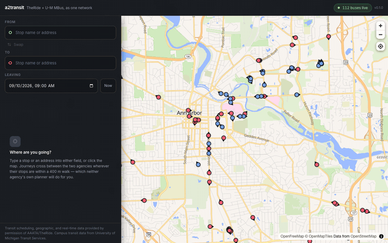

# a2transit

Ann Arbor is served by two bus networks that ignore each other: **TheRide**, the
city system, and **U-M MBus**, the university shuttles. Neither agency's trip
planner will route you onto the other's buses, even where their stops share a
corner — 728 of their stop pairs are within a 400 m walk and some are under two
metres apart. a2transit loads both feeds into one routing graph, so a single
search plans across both, walks you between them, and adjusts for the buses that
are actually running late.

**[▶ Try it live](https://a2transit.vercel.app)** ·
[API docs](https://a2transit-api.onrender.com/docs)

  
  
  
  
  
  
  
  

Blake Transit Center → Pierpont Commons. Two options: 65 minutes on one
TheRide bus, or 32 minutes changing onto MBus halfway. 112 buses live.

> The demo runs on free tiers and sleeps after fifteen minutes idle, so the first
> load may spend a minute waking the API — it says so while it does.

## Stack

**Backend:** Python 3.12, FastAPI, SQLAlchemy, PostgreSQL + PostGIS, Redis, GTFS-Realtime
**Frontend:** TypeScript, React, Vite, MapLibre GL JS, OpenFreeMap

## Features

- Plan a trip across TheRide and MBus in one search — the first planner that
  routes between the two networks.
- Search by stop name or street address; both are looked up at once, so you can
  type either.
- Door to door: start and end anywhere, not just at a bus stop. Click the map to
  drop a point.
- Live vehicle positions on the map, and delays folded into the plan — a late
  bus changes which one you are told to catch, not just the time printed
  beside it.
- Every sensible option, not just the fastest: fewest changes first, fastest
  last, with walking time and transfers shown per option.
- Departure boards for any stop in the itinerary.
- Shareable trip links — the whole trip lives in the URL.
- Service alerts filtered to the routes you are actually using.

## Docs

[Routing](docs/routing.md) · [Architecture](docs/architecture.md) ·
[HTTP API](docs/api.md) · [Running it locally](docs/development.md) ·
[Deployment](docs/deployment.md) · [Measurements](docs/measurements.md) ·
[Feed provenance](docs/feeds.md)

## Licence and data

The code is MIT — see [LICENSE](LICENSE). **The transit data is not**, and the
two are kept separate on purpose: no feed data is redistributed in this
repository, `data/` is git-ignored, and TheRide's licence is explicitly
nontransferable. Full terms in [docs/licences.md](docs/licences.md).

TheRide requires this notice wherever their data appears. It is in the footer of
every screen and in the body of every `/plan` response:

> Transit scheduling, geographic, and real-time data provided by permission of
> AAATA/TheRide.

Campus transit data from University of Michigan Transit Services. Map tiles ©
OpenFreeMap and © OpenMapTiles, from OpenStreetMap data © OpenStreetMap
contributors.
